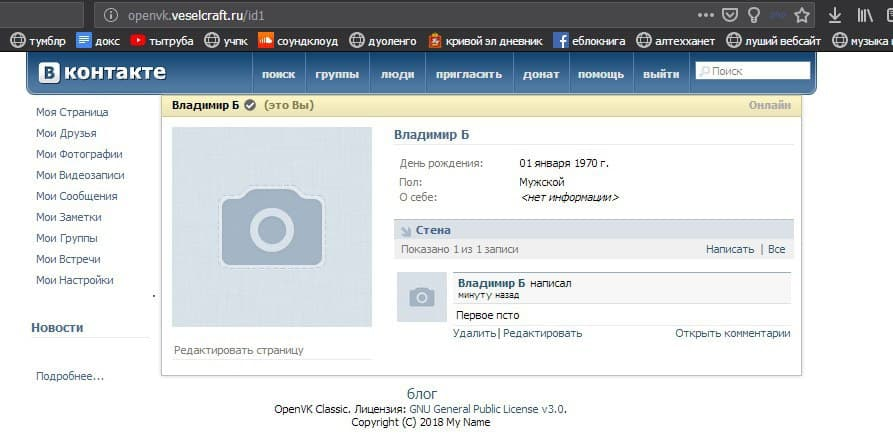

# OpenVK Classic

*Сохранённый скриншот, датированный 11 ноября 2018 г.*

Небольшой экспериментальный проект по имитации старого ВК, в исходнике которого содержится **очень** много г\*внокода, с уязвимостями, которые уничтожили существующий на тот момент популярный инстанс OpenVK 2018 года.

Данный код был закрыт в 2020 г., но позднее в 2022 г. был переоткрыт только для референса.

Пожалуйста, не используйте данный продукт в качестве основной социальной сети. Вместо этого используйте новый [OpenVK](https://github.com/openvk/openvk), который находится в активной разработке.

*Чтобы открыть исходный код OpenVK Classic - откройте папку [src](src).*
